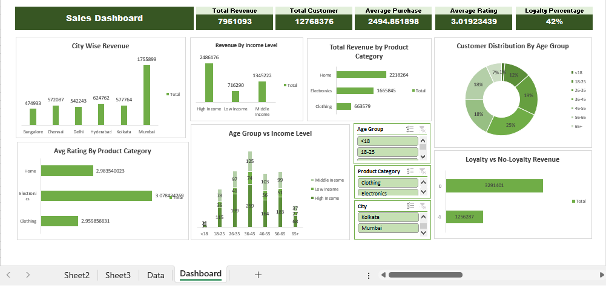
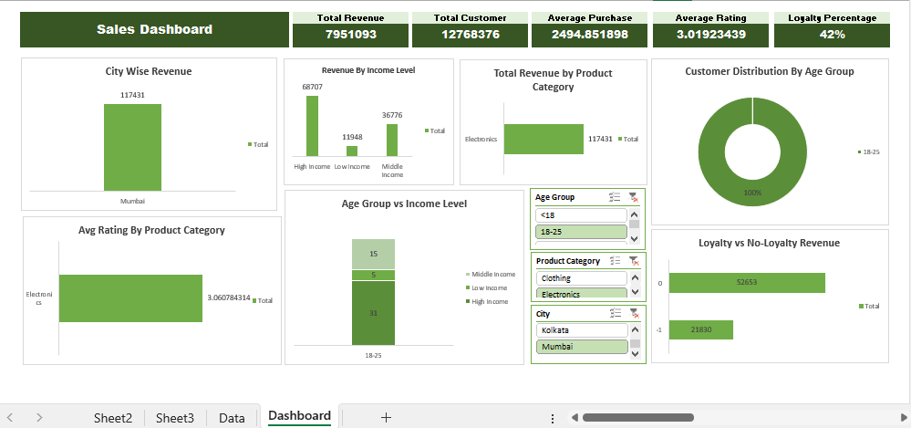

# Sales-Perfomance-Dashboard-Excel
# 📌 Project Overview
Cleaned messy sales data set using advance excel formulas and power query. Developed an interactive dashboard using pivot table and pivot charts to visualize product performance and trends, improving reporting efficiency

# 📂 Dataset
The dataset contains the following columns:
| columns            | Description                                       |
|--------------------|---------------------------------------------------| 
| customer_id        | Unique identifier for each order                  |
| age                | age of customer                                   |
| gender             | gender of customer                                |
| annual_income      | annual income of the customer                     |
| purchase_amount    | amount of purchase a customer made                |
| purchase_data      | date of purchase                                  |
| city               | city in which the product is purchased            |
| product_category   |  category of the product                          |
| rating             | rating of the product                             |
| loyalty_member     | loyalty member or not?                            |

# 🔧 Data Cleaning & Transformation

- Created column for grouping ('age_group' + 'income_level')

- Bring consistency in data

- Changed data types for numeric columns

- filled null values

# 📊 Key Performance Indicators (KPIs)
- Total Revenue
- Total Customer
- Average Purchase
- Average Rating
- Loyalty Percentage

# 🎛 Interactive Slicers

To enable dynamic analysis, slicers were created for:
- Age Group
- Product Category
- City

# 📈 Visualizations (Excel Charts)
| Chart                |  Type |
|-----------------------|---------------|  
|City vise revenue   | Clustered Column chart|
|Revenue by income level   | Clustered Column chart|
|Total revenue by product category | Clustered bar chart|
|customer distribution by age group | Doughnut Chart|
|Average rating by product category | Clustered Bar Chart|
|Age group by income level | Clustered column Chart|
|Loyalty vs No-loyalty revenu | Clustered Bar Chart|

# 📊 Dashboard Overview
## Dashboard

## Dashboard With Slicer 

# 🚀 Tools Used

**Microsoft Excel – for data cleaning, analysis, slicers, and visualizations**

# 👤 Author

**Hamiz Ansari** 
- **GitHub:** [github.com/hamiz-21-07](https://github.com/hamiz-21-7-06)
- **Email:** [hamizansari06@gmail.com](hamizansari06iqraizhar72@gmail.com)

# 🌟 Feedback & Support

Feel free to share suggestions or compliments — your feedback is appreciated!  
If you found this project useful, please consider giving it a ⭐️.
